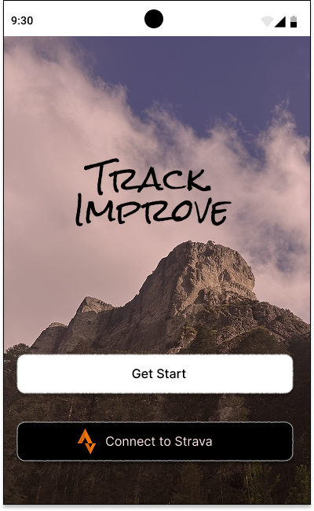
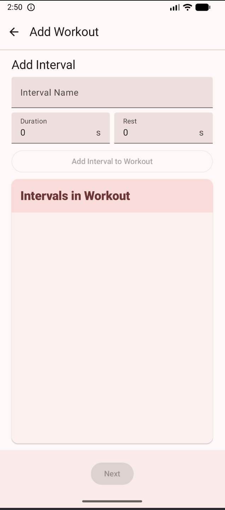
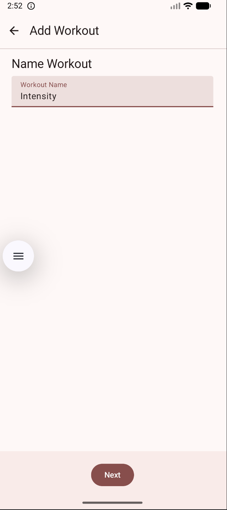
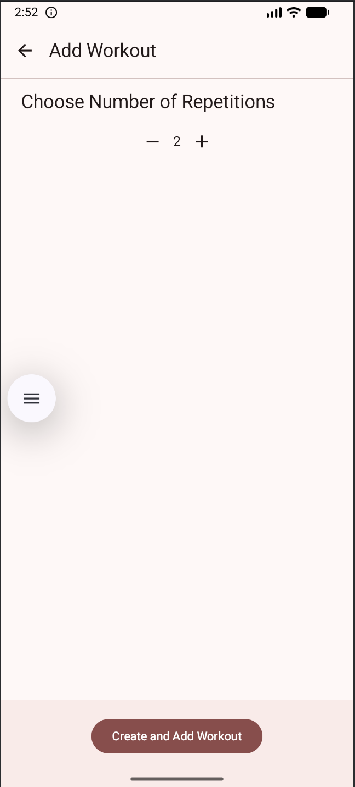

# hiit-timer-kmp
An application creating using Kotlin Multiplatform to manage sequential timers of variable lengths used in HIIT (high intensity interval training) exercises.

---

## Design

  
  

[View design in Figma](https://www.figma.com/design/6vZX0mpIsVlsEWiYt2Jq45/HIIT?node-id=0-1&t=Mmp4sudYLdysP95g-1)

---

## Screenshots

  
  
  

